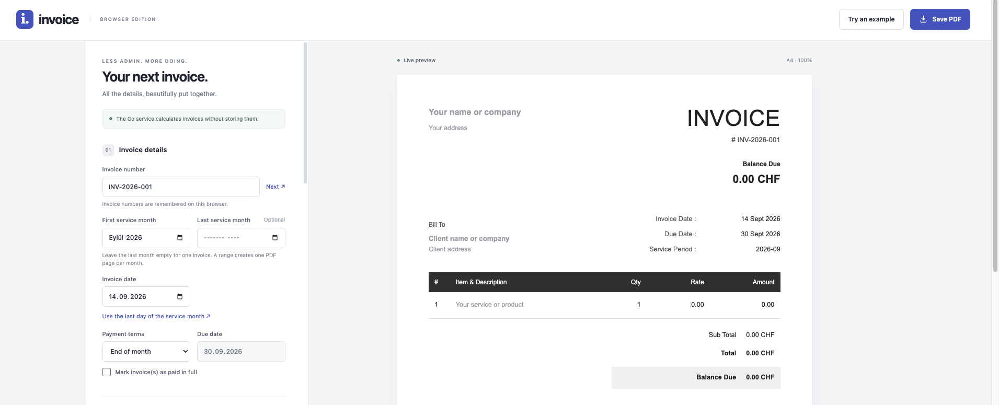

# Invoice

Go backend ile çalışan, tarayıcıdan aylık fatura hazırlayıp PDF olarak
kaydetmeye yarayan küçük bir uygulama.

Uygulama tek bir ay için fatura hazırlayabilir veya seçilen tarih aralığındaki
her ay için ayrı bir A4 sayfası oluşturabilir. Tarihler, tutarlar, vergiler,
fatura numaraları ve ödeme durumu Go API tarafından doğrulanır ve hesaplanır.

## Özellikler

- Tek aylık veya çok aylık fatura oluşturma
- Her hizmet ayı için otomatik artan fatura numarası
- Her hizmet ayının son gününe göre otomatik due date
- `Paid` durumunda toplam tutarı koruyup bakiyeyi sıfırlama
- CHF, EUR, USD, GBP ve TRY desteği
- Vergi ve toplam hesaplamalarında tam sayı kullanımı
- Tarayıcıdan A4, çok sayfalı PDF kaydetme
- Vercel Go Function desteği
- Hesap veya veritabanı gerektirmeyen kullanım

## Yerelde çalıştırma

Go 1.25 veya daha yeni bir sürüm gereklidir.

Repository'yi indirdikten sonra proje klasöründe çalıştır:

```sh
go mod download
go run ./cmd/server
```

Terminalde şu adres gösterilir:

```text
Invoice web app: http://127.0.0.1:8080
```

Tarayıcıda [http://127.0.0.1:8080](http://127.0.0.1:8080) adresini aç.

Farklı bir port kullanmak için:

```sh
go run ./cmd/server -addr 127.0.0.1:3000
```

## Web arayüzünden fatura oluşturma



Örneğin Mart 2025 ile Ağustos 2026 arasındaki ödenmiş faturaları hazırlamak
için formu şu şekilde doldur:

```text
First service month: 2025-03
Last service month:  2026-08
Invoice date:        2026-09-14
Payment terms:       End of month
Paid:                seçili
```

Satıcı, müşteri ve hizmet bilgilerini girdikten sonra **Save PDF** düğmesine
bas. Tarayıcının yazdırma penceresinde hedef olarak **Save as PDF** seç.

Bu örnekte tek bir PDF içinde 18 ayrı A4 fatura sayfası oluşur:

```text
INV-2026-001  Service period: 2025-03  Due date: 2025-03-31
INV-2026-002  Service period: 2025-04  Due date: 2025-04-30
...
INV-2026-018  Service period: 2026-08  Due date: 2026-08-31
```

Tüm sayfalarda invoice date `2026-09-14` olarak kalır. `End of month`
seçildiğinde due date, invoice date yerine ilgili hizmet ayından hesaplanır.

Tek fatura oluşturmak için **Last service month** alanını boş bırak.

## Vercel'e deploy etme

Projenin tamamını GitHub'a gönder:

```sh
git add .
git commit -m "Add Go invoice web app"
git push
```

Ardından Vercel'de:

1. **Add New → Project** seç.
2. GitHub repository'sini içe aktar.
3. **Root Directory** alanını proje kökü olarak bırak.
4. Framework seçimini **Other** olarak bırak.
5. Ek bir build veya install komutu tanımlama.
6. **Deploy** düğmesine bas.

`vercel.json`, Vercel'in Go Framework Preset'ini seçer. Kök dizindeki `main.go`
web dosyalarını binary içine gömer, web arayüzünü yayınlar ve şu endpoint'i
oluşturur:

```text
POST /api/invoice
```

Deploy tamamlandığında Vercel'in verdiği adresi açıp formu doğrudan
kullanabilirsin.

## Go API nasıl çalışır?

Web formu **Save PDF** düğmesine basıldığında form verilerini `/api/invoice`
adresine JSON olarak gönderir. Go backend:

1. Form alanlarını ve fiyatları doğrular.
2. Başlangıç ve bitiş arasındaki ayları oluşturur.
3. Her ay için fatura numarasını artırır.
4. Vergi, toplam ve kalan bakiye değerlerini hesaplar.
5. Her hizmet ayı için doğru due date değerini üretir.
6. Hesaplanan faturaları JSON olarak tarayıcıya döndürür.

API sunucuda PDF veya müşteri kaydı saklamaz. İstekler bellekte işlenir.
Vercel, platformun standart istek loglarını tutabilir. Kullanılan fatura
numaraları yalnızca ilgili tarayıcının local storage alanında hatırlanır.

## Komut satırından PDF oluşturma

Web arayüzüne ek olarak CLI sürümü de kullanılabilir. CLI, Chrome veya Chromium
ile her faturayı ayrı PDF dosyası olarak `invoices/` altında arşivler.

İlk kullanımda yerel yapılandırmayı oluştur:

```sh
cp -n data/config.example.yaml data/config.yaml
```

`data/config.yaml` içindeki satıcı, müşteri, fiyat ve ödeme bilgilerini düzenle.

Tek ay için:

```sh
go run ./cmd/invoice \
  -period 2026-08 \
  -date 2026-09-14 \
  -paid
```

Ay aralığı için:

```sh
go run ./cmd/invoice \
  -from 2025-03 \
  -to 2026-08 \
  -date 2026-09-14 \
  -paid
```

Bu komut 18 ayrı fatura klasörü ve PDF dosyası oluşturur. `-from` ve `-to`
birlikte kullanılmalıdır; `-period` ile birlikte kullanılamaz.

Tüm seçenekleri görmek için:

```sh
go run ./cmd/invoice -help
```

Chrome otomatik bulunamazsa yolu açıkça verebilirsin:

```sh
go run ./cmd/invoice \
  -chrome "/Applications/Google Chrome.app/Contents/MacOS/Google Chrome"
```

## Proje yapısı

```text
invoice/
├── main.go                 # Vercel Go sunucusu ve gömülü web dosyaları
├── cmd/
│   ├── invoice/            # PDF oluşturan CLI
│   └── server/             # Yerel web sunucusu
├── data/
│   └── config.example.yaml # CLI için örnek yapılandırma
├── internal/
│   ├── invoice/            # Doğrulama ve hesaplamalar
│   ├── httpapi/            # Web formu için Go API
│   └── pdf/                # Chrome ile PDF üretimi
├── templates/
│   └── invoice.html        # CLI fatura şablonu
├── web/                    # Tarayıcı arayüzü
├── go.mod
└── vercel.json
```

## Testler

Tüm Go testlerini, race detector ve statik kontrolleri çalıştırmak için:

```sh
go test -race ./...
go vet ./...
node --check web/app.mjs
node --check web/invoice.mjs
```

Yerel Chrome entegrasyon testi isteğe bağlıdır:

```sh
INVOICE_TEST_CHROME="/Applications/Google Chrome.app/Contents/MacOS/Google Chrome" \
  go test ./internal/pdf -run TestChromeRender -v
```

## Önemli davranışlar

- Web sürümü ay aralığını tek, çok sayfalı PDF olarak yazdırır.
- CLI sürümü her ayı ayrı PDF dosyası olarak arşivler.
- `Paid` seçildiğinde toplam değişmez; `Amount Paid` toplamı gösterir ve
  `Balance Due` sıfır olur.
- Aynı ay aralığını tekrar kaydetmek yeni fatura numaraları kullanabilir.
- Tarayıcı verisini temizlemek, hatırlanan fatura numaralarını da siler.
- CLI mevcut arşiv dosyalarının üzerine yazmaz.
